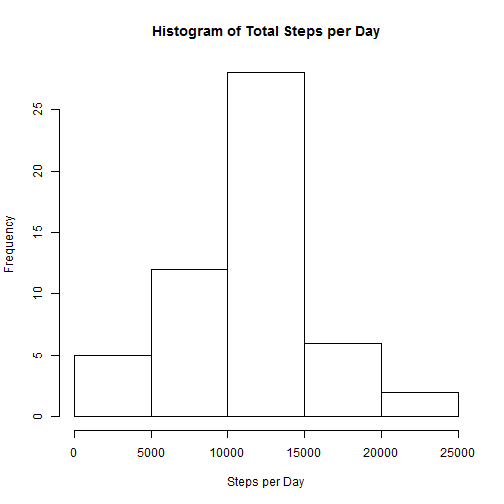
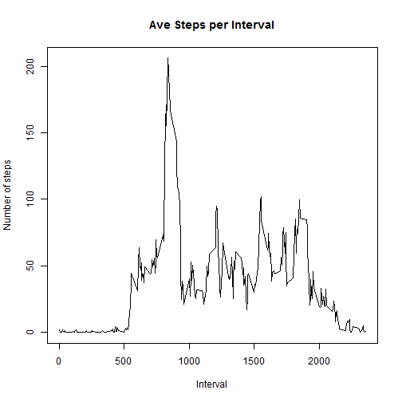
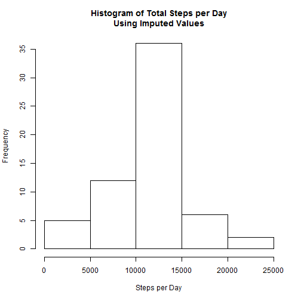
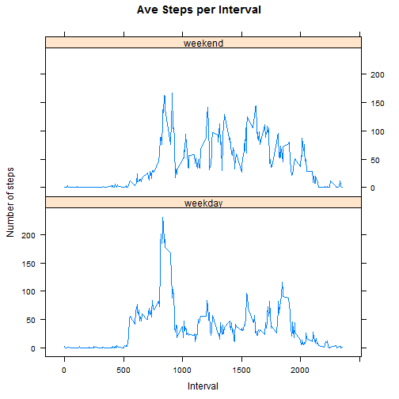

## Loading and preprocessing the data

Load the data.

```r
data <- read.csv( "activity.csv" )
```

Clean the data by removing the rows with NA for steps.

```r
cldata <- data[!is.na(data["steps"]),]
```

For easier typing later, assign each column to a variable.

```r
steps     <- cldata[["steps"]]
d         <- cldata[["date"]]
interval  <- cldata[["interval"]]
```

## What is mean total number of steps taken per day?

```r
stepsPerDay <- tapply( steps , d , sum )

hist( 
  stepsPerDay , 
  main="Histogram of Total Steps per Day" ,
  xlab="Steps per Day"
)
```



```r
mnStepsPerDay <- mean( stepsPerDay[ !is.na(stepsPerDay) ] )
mdStepsPerDay <- median( stepsPerDay[ !is.na(stepsPerDay) ] )
```
The mean of Total Steps per Day is 1.0766189 &times; 10<sup>4</sup>.  
The median of Total Steps per Day is 10765.

## What is the average daily activity pattern?

```r
stepsPerInt <- tapply( steps , interval , mean )
plot( 
  interval[ 1:length(stepsPerInt) ] ,
  stepsPerInt ,
  type="l" ,
  main="Ave Steps per Interval" ,
  xlab="Interval" ,
  ylab="Number of steps"
)
```



```r
maxInt <- names( which.max( stepsPerInt ) )
```
The 5-minute interval which on average contains the maximum number of steps is 835.

## Imputing missing values

```r
stepsNA <- is.na( data["steps"] )
totalNA <- sum( stepsNA )
```
The total number of missing values in the data set is 2304.

Missing values will be imputed by using the mean of the 5-minute interval.

```r
imdata <- data
imdata["steps"][stepsNA] <- stepsPerInt[as.character(imdata["interval"][stepsNA])]
```

Create vars for each column with imputed data.

```r
steps_     <- imdata[["steps"]]
d_         <- imdata[["date"]]
interval_  <- imdata[["interval"]]
```

Analyze the distribution which contains the imputed values.

```r
stepsPerDay_ <- tapply( steps_ , d_ , sum )

hist( 
  stepsPerDay_ , 
  main="Histogram of Total Steps per Day\nUsing Imputed Values" ,
  xlab="Steps per Day"
)
```



```r
mnStepsPerDay_ <- mean( stepsPerDay_ )
mdStepsPerDay_ <- median( stepsPerDay_ )
```
The mean of Total Steps per Day is 1.0766189 &times; 10<sup>4</sup>.  
The median of Total Steps per Day is 1.0766189 &times; 10<sup>4</sup>.

Comparing the distribution containing data imputed by using the mean of the 5-minute interval with the distribution in which missing values were removed, the histograms appear to be the same.  The means are the same, but the medians are slightly different.

## Are there differences in activity patterns between weekdays and weekends?
Calculate the average steps per interval on weekends and weekdays.

```r
weekday <- as.factor( 
  sapply(
    weekdays( strptime( imdata[,2] , "%Y-%m-%d" ) , abbreviate=T ) ,
    function(d) if(d=="Sat"|d=="Sun"){"weekend"} else{"weekday"}
  )
)
imdata <- data.frame( imdata , weekday )

stepsPerInt_wknd <- tapply( 
  imdata[,1][weekday=="weekend"] ,  # steps
  imdata[,3][weekday=="weekend"] ,  # interval
  mean
)
stepsPerInt_wkdy <- tapply( 
  imdata[,1][weekday=="weekday"] ,  # steps
  imdata[,3][weekday=="weekday"] ,  # interval
  mean
)
```

Plot the average steps per interval on weekends and weekdays.

```r
stepsW    <- c( stepsPerInt_wknd , stepsPerInt_wkdy )
intervalW <- c( imdata[,3][1:(2*length(stepsPerInt_wknd))] )
weekdayW  <- c(
    rep( "weekend" , length(stepsPerInt_wknd) ) ,
    rep( "weekday" , length(stepsPerInt_wkdy) )
)

library(lattice)
xyplot(
  stepsW ~ intervalW | weekdayW ,
  type = "l" ,
  layout = c(1,2) ,
  main = "Ave Steps per Interval" ,
  xlab = "Interval" ,
  ylab = "Number of steps"
)
```


